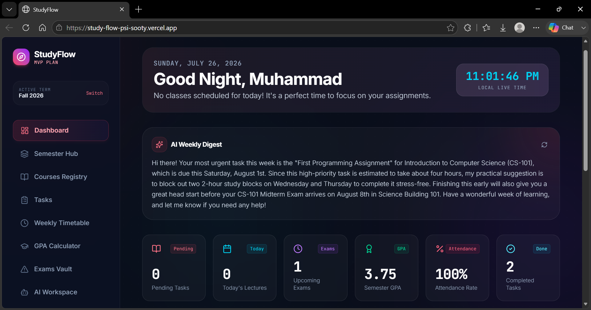
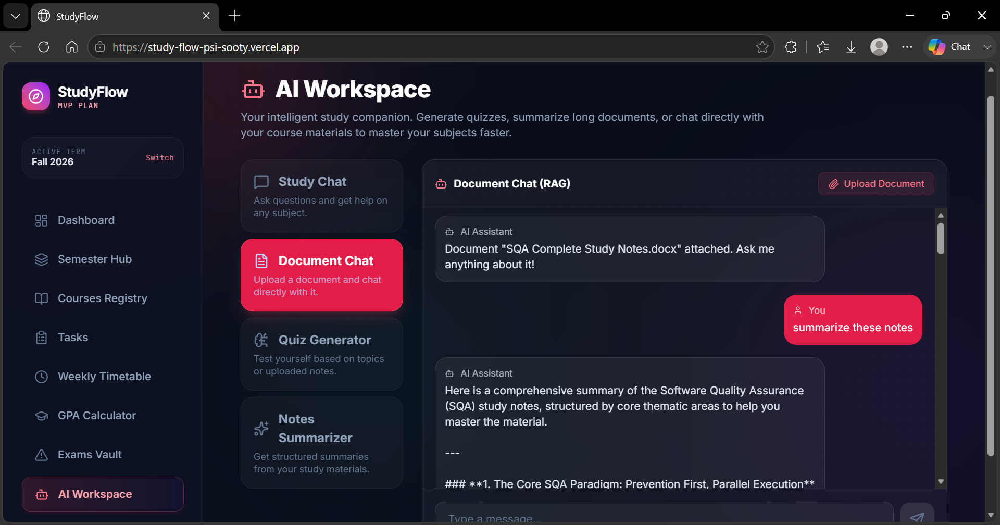
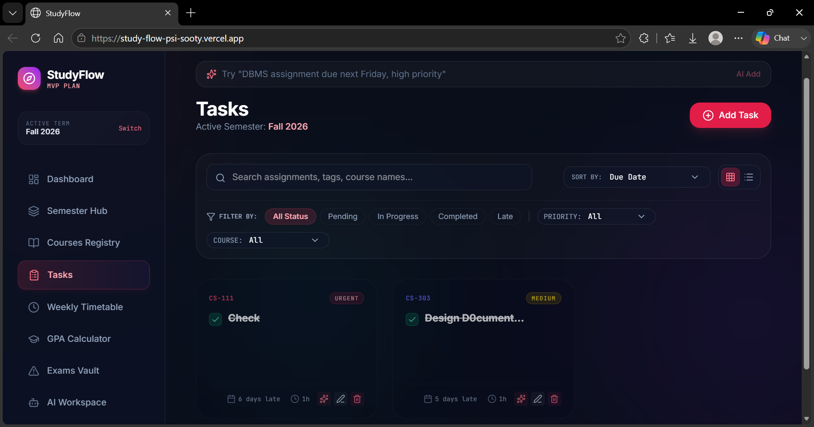
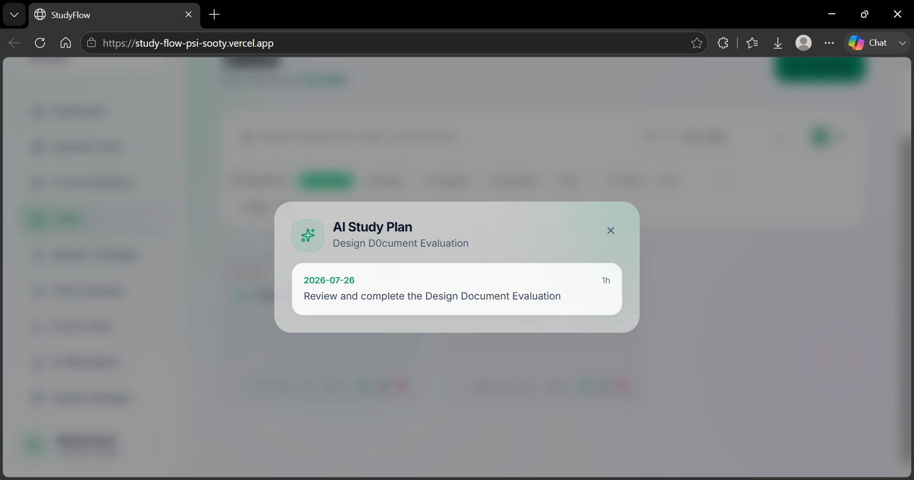
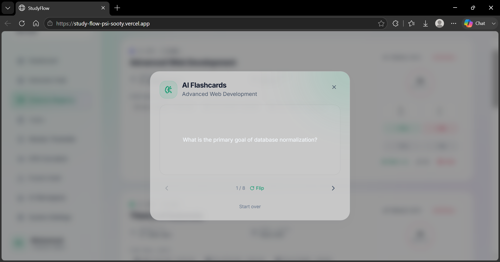
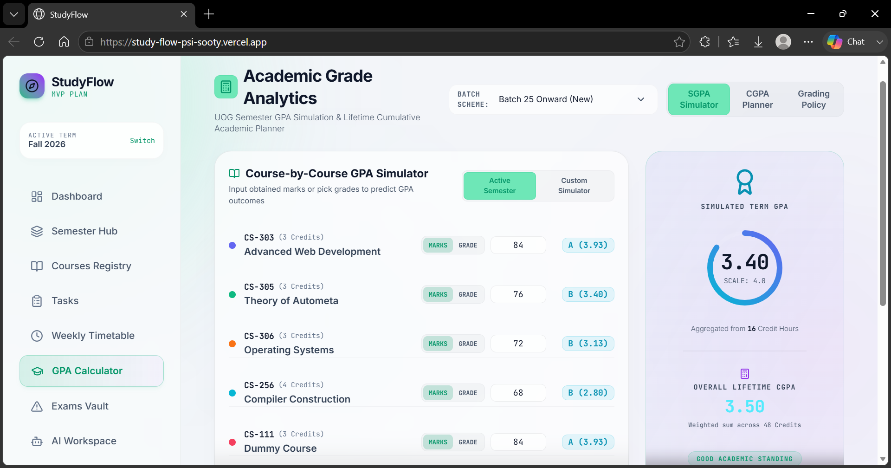
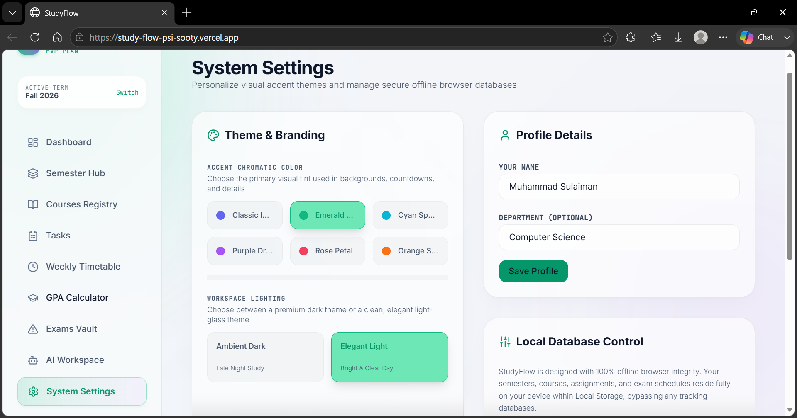
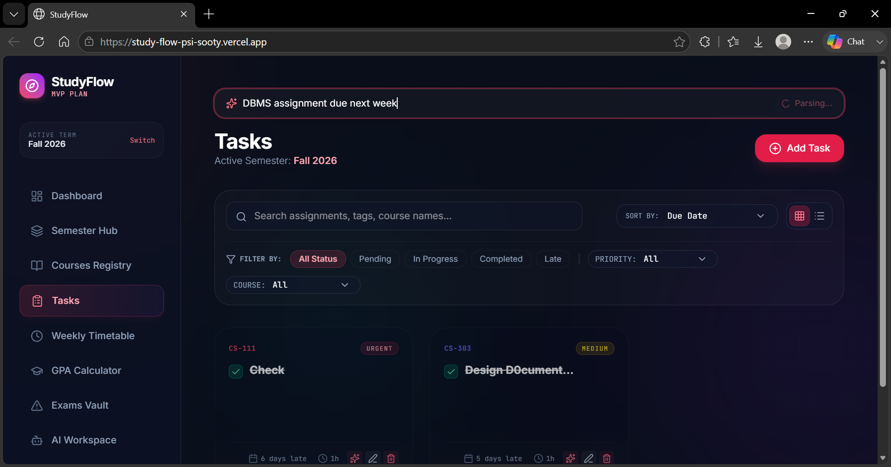
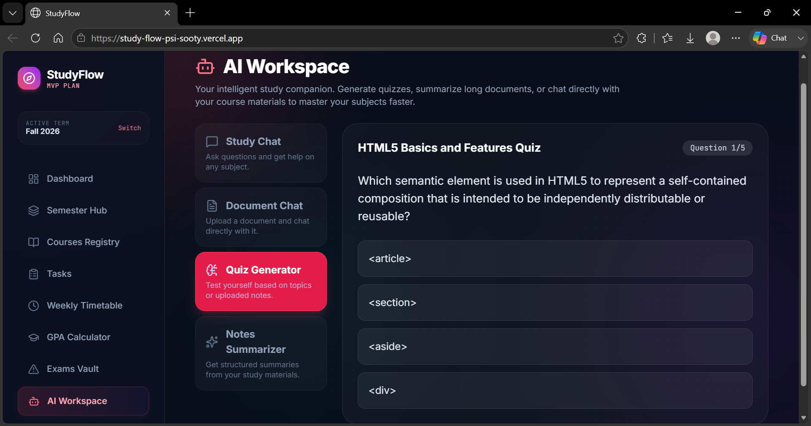
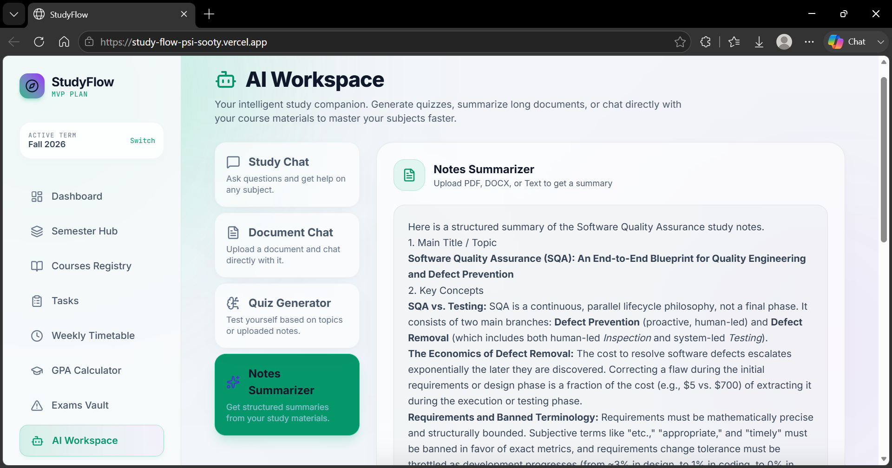

# 🎓 StudyFlow - The Intelligent Academic Companion

<div align="center">
  <p><strong>Master your semester, track your GPA, and study smarter with a unified AI-powered environment.</strong></p>
  <p><i>A next-generation student dashboard bridging the gap between task management and active learning.</i></p>
</div>

---

## 🌟 The Vision & Problem Statement

University and college students often juggle multiple courses, scattered deadlines, and complex grading rubrics while struggling to retain massive amounts of study material. The current landscape of student tools forces users to constantly context-switch:
- You have a calendar app for deadlines.
- You have a portal to check your GPA.
- You have a separate notes app to read PDFs.
- You have ChatGPT open in another tab to ask questions.

**StudyFlow** eliminates context-switching by centralizing all academic tracking (courses, deadlines, exams, and GPA calculations) into a single, beautifully designed dashboard. Most importantly, it integrates a powerful **AI Workspace** directly into your study environment. It is built for students who want to stay organized and leverage cutting-edge AI to study more efficiently, all in one place.

---

## 🔗 Live Deployment
**[👉 Experience StudyFlow Live Here](https://study-flow-psi-sooty.vercel.app/)** 

*(Note: The frontend is hosted on Vercel, with a dedicated Node.js/Express backend running on Railway to safely handle file parsing and Gemini AI orchestration).*

---

## 🚀 Deep Dive: Core Features

StudyFlow isn't just a to-do list; it's a comprehensive academic operating system.

### 1. Comprehensive Academic Dashboard
Your command center. The dashboard provides an immediate, high-level overview of your academic life using a stunning, responsive glassmorphism UI. 
- **Urgent Deadlines:** Automatically highlights assignments and exams due in the next 7 days.
- **Current GPA:** Real-time calculation of your cumulative GPA across all active courses.
- **AI Weekly Digest:** A natural-language summary generated on-the-fly, analyzing your current workload and offering actionable advice for the week ahead.

### 2. Intelligent Task & Exam Management
Never miss a homework assignment, project, or midterm again.
- **Natural Language Quick-Add:** Type exactly what's on your mind (e.g., *"DBMS assignment due next Friday, high priority"*) and the AI instantly parses it, figures out the exact dates, and categorizes it perfectly into your database.
- **Interactive Study Plan Generator:** Got a massive 20-hour project due in two weeks? StudyFlow uses AI to break the task down into sensible, day-by-day chunks so you never have to cram at the last minute.

### 3. The AI Workspace: Active Learning Tools
The crown jewel of StudyFlow. We transform static study materials into interactive learning sessions.
- **Document Chat (RAG):** Upload any lecture slide (PDF), syllabus (DOCX), or text file. StudyFlow extracts the text and allows you to chat directly with your document. Ask the AI to find specific formulas, summarize chapters, or explain complex paragraphs.
- **Notes Summarizer:** Instantly generate structured, markdown-formatted summaries (Main Title, Key Concepts, Brief Summary) from your uploaded documents.
- **Instant Quiz Generator:** Provide a topic or upload your lecture notes to instantly generate an interactive multiple-choice quiz (complete with answer explanations) to test your knowledge before the real exam.
- **AI Flashcards:** Automatically generate concise, testable review flashcards based on your notes for active recall practice.

### 4. Course & Semester Tracking
- **GPA Simulator:** Calculate your current GPA and project future grades based on course credits and target scores.
- **Color-Coded Organization:** Visually separate your courses to keep your mental workspace clean.

### 5. Premium User Experience
- **Dark/Light Mode Themes:** Highly customizable visual themes with dynamic color accents.
- **Fluid Animations:** Powered by Framer Motion, every interaction—from opening modals to completing tasks—feels physical and satisfying.
- **Local-First Architecture:** Instant load times with robust local storage persistence ensuring your data is always there when you open the app.

---

## 📸 Project Showcase

Here is a look at StudyFlow in action:

1. **The Command Center Dashboard**  
     
   *The main dashboard featuring the AI Weekly Digest, upcoming tasks, and GPA overview.*

2. **The AI Workspace (Document Chat RAG)**  
     
   *Chatting directly with an uploaded PDF syllabus to quickly extract key grading rubrics.*

3. **Intelligent Task Manager**  
     
   *Managing course assignments and projects with priority tagging and course association.*

4. **AI Study Plan Generator**  
     
   *The AI breaking down a large assignment into a manageable, day-by-day study plan.*

5. **Interactive AI Flashcards**  
     
   *Generating practice flashcards for a specific course topic to utilize active recall.*

6. **Advanced GPA Calculator**  
     
   *Calculating GPA based on course credits and target scores.*

7. **Customizable themes**  
     
   *Customizable themes for a personalized user experience.*

8. **Quick Add**  
     
   *Adding tasks quickly and efficiently using natural language processing.* 

9. **Interactive Quiz Generator**  
     
   *Generating practice quizzes for a specific course topic to utilize active recall.* 

10. **Notes Summarizer**  
      
    *Summarizing notes to quickly get the main idea of the course.*

---

## 🛠️ System Architecture & Technologies Used

StudyFlow uses a modern, decoupled architecture to ensure maximum performance and security.

### Frontend Ecosystem (Vercel)
- **React 19 & Vite:** For blazing-fast rendering, state management, and a seamless developer experience.
- **Tailwind CSS 4:** For building the intricate, responsive glassmorphism design system without leaving the markup.
- **Motion (framer-motion):** For fluid layout transitions, micro-interactions, and modal animations.
- **Lucide React:** For clean, scalable, and modern typography-matched iconography.
- **React Markdown:** To safely and cleanly render structured markdown responses from the AI.

### Backend & File Parsing (Railway)
- **Express.js (Node.js):** A lightweight, robust server to proxy AI requests, ensuring API keys are never exposed to the client.
- **Multer:** Handles `multipart/form-data` memory buffering for seamless document uploads.
- **pdf-parse & mammoth:** Powerful extraction libraries that parse raw text from uploaded PDFs and DOCX files before feeding them to the AI context window.

### AI Integration
- **Google Gemini (gemini-3.5-flash):** Used as the core intelligence engine. Gemini was chosen specifically for its massive context window (perfect for reading full, multi-page lecture documents) and incredibly fast response times. We interact with it via the native REST API using strict JSON Schema enforcement to guarantee the frontend receives perfectly parsable UI components (like quizzes and study plans).

---

## 💻 Local Development Setup

Want to run StudyFlow locally or contribute to the project? Follow these steps:

### Prerequisites
- Node.js (v18+ recommended)
- A [Google Gemini API Key](https://aistudio.google.com/)

### Installation & Execution

1. **Clone the repository:**
   ```bash
   git clone https://github.com/sulaimanyasir/StudyFlow.git
   cd student-semester-planner
   ```

2. **Install all dependencies:**
   ```bash
   npm install
   ```

3. **Configure Environment Variables:**
   Create a `.env` file in the root directory. You will need to add your Gemini API Key here so the backend can authenticate with Google.
   ```env
   GEMINI_API_KEY=your_google_gemini_api_key_here
   ```
   *(Note: To connect the local frontend to the local backend, the app defaults to `http://localhost:5000` automatically).*

4. **Start the Application:**
   Because StudyFlow uses a decoupled architecture, you need to run both the frontend UI and the backend AI proxy server simultaneously.
   
   Open **Terminal 1** (Starts the Vite Frontend on port 3000):
   ```bash
   npm run dev
   ```
   
   Open **Terminal 2** (Starts the Express Backend on port 5000):
   ```bash
   npm run server
   ```

5. **Launch:**
   Open your browser and navigate to `http://localhost:3000` to start studying smarter!

---
<div align="center">
  <i>Built with passion to make learning more accessible, organized, and intelligent.</i>
</div>
